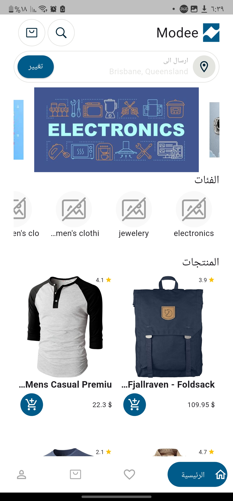
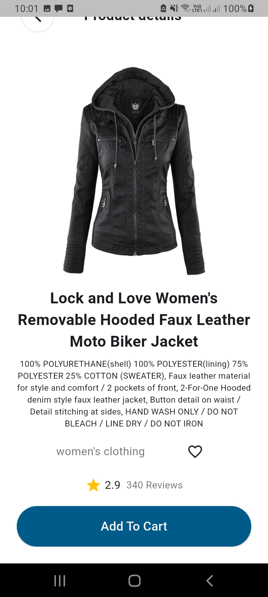
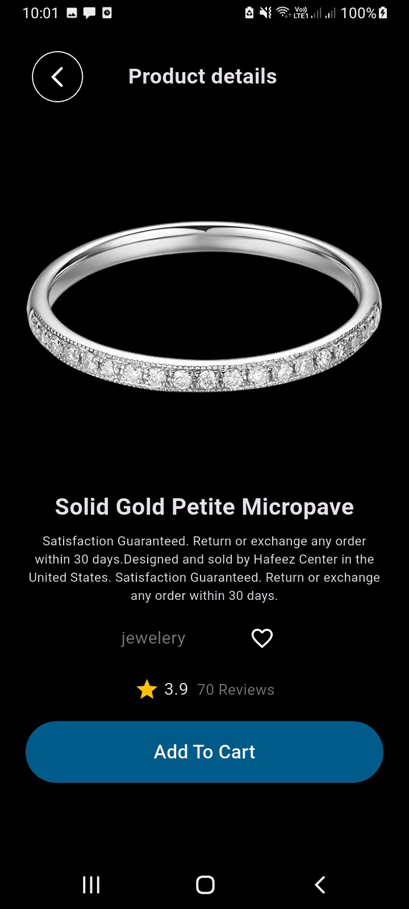
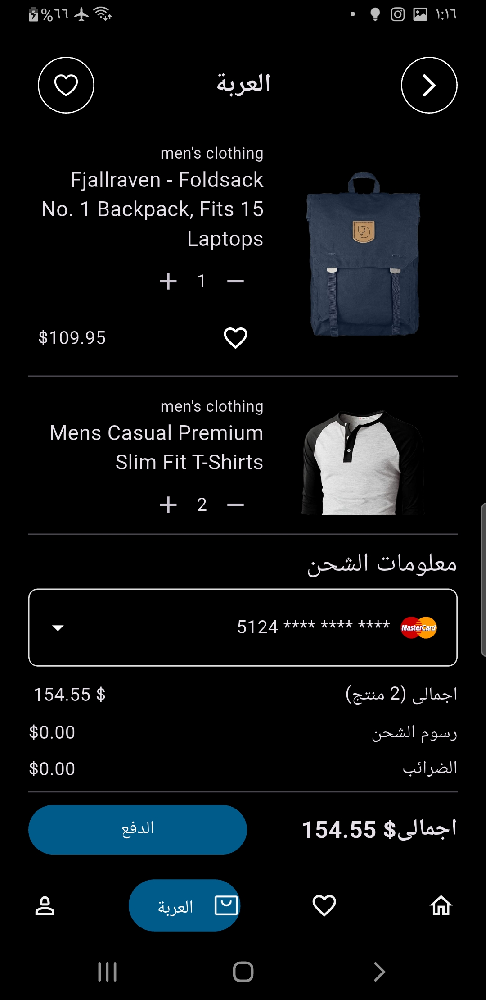

#  📱  Flutter Mini E-Commerce App "Modee"

A mini e-commerce Flutter application built as part of a technical task.  
The app demonstrates clean architecture, state management, API integration, localization, theming, and cart functionality.
## 📱 Features
    
    
    
### ✅ Implemented
- **Home Page**
  - Bottom navigation bar (Home, Favorites, Cart, Profile)
  - Local banners 
  - Fetch categories from API
  - Fetch and display products in a responsive grid view
- **Cart Page**
  - Add products to cart from Home
  - Store cart data securely using `flutter_secure_storage`
  - Display cart items (name, image, price, quantity)
  - Cart summary with total price calculation
  - Update/remove cart items
- **Architecture**
  - Clean Architecture with MVVM pattern
  - Separation of concerns: `data`, `domain`, `App`
- **State Management**
  - [Riverpod](https://riverpod.dev) + Provider
- **API Integration**
  - Using [Dio](https://pub.dev/packages/dio) for HTTP requests
  - Products: `https://fakestoreapi.com/products`
  - Categories: `https://fakestoreapi.com/products/categories`
- **Extra Features**
  - Light/Dark mode support
  - Localization (English 🇬🇧 & Arabic 🇪🇬)
  - Product Details Page
 
- **⚙️ Tech Stack**  
  - Flutter (UI Framework)
  - Riverpod + Provider (State Management)
  - Dio (Networking)
  - Flutter Secure Storage (Cart persistence)
  - MVVM + Clean Architecture (Scalable structure)
  - Intl (Localization)
 
**📌 State Management Reasoning**
  I chose Riverpod because:
    - It allows fine-grained control of state and dependency injection.
    - Scales better with Clean Architecture + MVVM compared to setState

**🌍 Localization**
  - English (default)
  - Arabic (RTL support)
-Easily extendable by adding translations in the l10n folder.

**🌓 Theming**
  - Light & Dark mode supported out of the box.
  - System preference is detected automatically.
  
